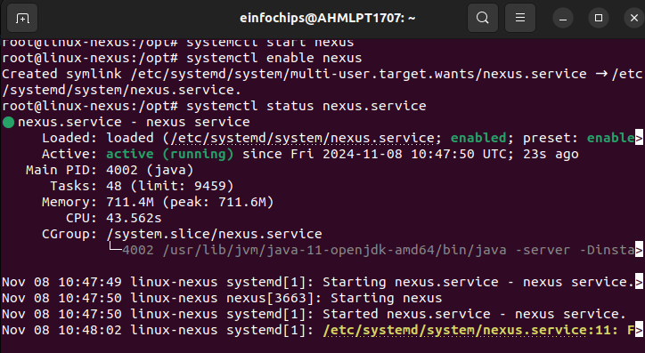
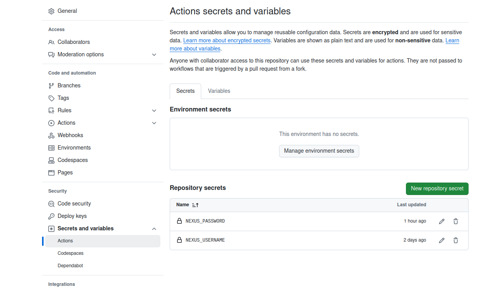
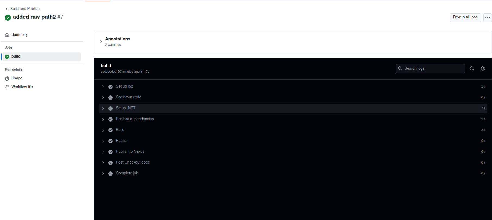

## Nexus and Git actions.

**Create a virtual machine and install nexus-repo into it (follow the steps mention in nexus-installation.md)**


**Create a new repository in nexus after logging into it and select the format as raw(hosted) as we have to publish .dll file**

**Make a directory with nexus-git and to start a .net application**
  Initialize the .net project

  ```
  dotnet new console -n nexus-git
  ```
  Write some basic code in Program.cs, e.g.

  ```
  Console.WriteLine("Hello, World! from Yash M");
  ```
  **Create a git repo**
  Push the code to the GitHub.

**Create a .github/workflows/publish.yaml file:**
  This file will build your .NET project, create a .dll file, and then upload it to Nexus.

```
name: Build and Publish

on:
  push:
    branches:
      - master

jobs:
  build:
    runs-on: ubuntu-latest

    steps:
    - name: Checkout code
      uses: actions/checkout@v2

    - name: Setup .NET
      uses: actions/setup-dotnet@v1
      with:
        dotnet-version: '8.0.x' # Specify the .NET version you want to use

    - name: Restore dependencies
      run: dotnet restore

    - name: Build
      run: dotnet build --configuration Release --no-restore

    - name: Publish
      run: dotnet publish --configuration Release --output ./output

    - name: Publish to Nexus
      env:
        NEXUS_USERNAME: ${{ secrets.NEXUS_USERNAME }}
        NEXUS_PASSWORD: ${{ secrets.NEXUS_PASSWORD }}
      run: |
        curl -v -u $NEXUS_USERNAME:$NEXUS_PASSWORD --upload-file ./bin/Debug/net8.0/nexus-git.dll http://<server-ip>/repository/yashm-net/raw/nexus-git.dll #Copy this url from the nexus-repo of the created repo and add raw after it defining the format.
```

 **Pass the nexus username and nexus password as secrets**

 This can be done by going to repository settings------> Secrets and Variables-------->Actions------>Repository secrets

 

 ### Push the code to github with the changes made for the workflows.

 

 ## Navigate to the nexus-repo on your server ip to check if the .dll file is uploaded.


